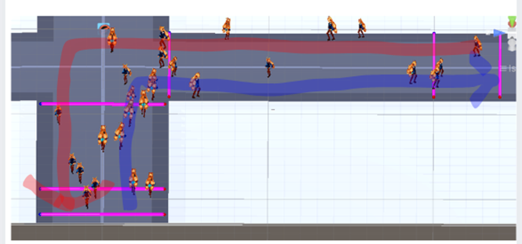

# PopulationFlowMaker

Unityで（右側通行・左側通行等の）歩行者流を生成する簡易ツールです。強化学習（ML-Agents）などで「毎エピソード動的な歩行者流を用意したい」等の用途を想定しています。
逆走者や停止者なども任意確率で追加可能で、リアルな歩行者流環境を発生させることができます。

<p>
  
</p>


## 開発環境

| 項目 | 値 |
| --- | --- |
| Unity | 2023.2.8f1 |

## できること

| 機能 | 概要 |
| --- | --- |
| 2方向の歩行者生成 | Start→Goal / Goal→Start の人数を別々に設定 |
| 左側/右側通行の切替 | `IsLeftSideTraffic` で切替（false=右側通行） |
| 停止者・逆走者の混在 | 確率（%）で停止/逆走を混ぜる |
| 歩行者の身長のランダム化 | `MinHeightScale`〜`MaxHeightScale` の範囲で生成時にスケールをランダム化 |
| 再生成 | 実行中に `Regenerate()` で作り直し可能 |


## クイックスタート

### 1) ラインを配置

ここで言う「ライン」とは、Cube（など）に以下をアタッチしたオブジェクトです。

- `LineObject.cs`
- `Box Collider`（`Is Trigger = True`）

配置ルール:

- スタート/ゴールを各 1 つ
- 中間ライン（Intermediate）を **2つ以上**
- 並び順は **Start → Intermediate（複数） → Goal**

例:

```
[Start] -> [Inter1] -> [Inter2] -> [Goal]
```

### 2) 歩行者 Prefab を準備

Prefab（歩行者）に以下をアタッチします。

| 必須コンポーネント | 用途 |
| --- | --- |
| `PedestrianController.cs` | 速度などの制御 |
| `NavMeshAgent` | NavMesh 上の移動 |
| `Rigidbody` | 物理挙動 |
| `Collider` | 衝突判定 |

`PedestrianController.cs` のパラメータ:

| 項目 | 意味 | 備考 |
| --- | --- | --- |
| `minSpeed` | 最小速度 | 速度は範囲内でランダムに決定 |
| `maxSpeed` | 最大速度 | `minSpeed <= maxSpeed` |
| `MinHeightScale` | 身長スケールの最小倍率 | 1.0 が基準（Prefabの元スケールに乗算） |
| `MaxHeightScale` | 身長スケールの最大倍率 | `MinHeightScale <= MaxHeightScale` |

### 3) 歩行者流マネージャを設定

Empty Object に `PopulationFlowManager.cs` をアタッチし、Inspector で値を設定します。

### 4) NavMesh をベイク

歩行者が移動する床/地形が NavMesh に含まれるようにベイクします。

### 5) 再生して生成を確認

Playすると歩行者流が生成されます。

### 6) 再生成（任意）

再生成したい場合は `PopulationFlowManager.Regenerate()` を実行します。

- Editor 上では、インスペクターのコンテキストメニューから実行できます。

## 設定項目（Inspector）

### PopulationFlowManager

| 項目 | 種別 | 説明 | 重要ポイント |
| --- | --- | --- | --- |
| `IsLeftSideTraffic` | bool | 左側通行かどうか（false：右側通行） | 通行方向のルール切替 |
| `terminalStart` | LineObject | スタート側の端ライン | Start/Goal は「端」 |
| `terminalGoal` | LineObject | ゴール側の端ライン | 端セグメントには生成されません（後述） |
| `intermediateLines` | List<LineObject> | 中間ラインのリスト | **2つ以上必須** / Start→Goal 順で登録 |
| `pedestrianPrefab` | GameObject | 歩行者 Prefab | `NavMeshAgent` 等が必要 |
| `S2GPedestrianCount` | int | Start→Goal の生成人数 | 方向別に指定 |
| `G2SPedestrianCount` | int | Goal→Start の生成人数 | 方向別に指定 |
| `ratioStationary` | float/int | 停止者の生成確率（%） | 0〜100 |
| `ratioReversing` | float/int | 逆走者の生成確率（%） | 0〜100 |

### PedestrianController

| 項目 | 説明 |
| --- | --- |
| `minSpeed` / `maxSpeed` | 移動速度のランダム範囲 |
| `MinHeightScale` / `MaxHeightScale` | 身長のランダム範囲（初期身長に乗算） |

## 仕様・注意点

| 項目 | 内容 |
| --- | --- |
| 生成位置 | 両端（Start/Goal を含む）セグメントには歩行者は生成されません。よって中間ラインは 2つ以上必須です。 |
| 想定環境 | 平坦な地形を想定（複雑な高低差は未検証） |
| 事前条件 | NavMesh の Bake |

## ML-Agents との連携

毎エピソード開始時に「パラメータをランダム化 → 再生成」を行うことで、強化学習で動的に利用できます。

### 歩行者流の再生成

```csharp
public PopulationFlowManager manager;

public override void OnEpisodeBegin()
{
  manager.Regenerate();
}
```

### パラメータのランダム化例

```csharp
manager.S2GPedestrianCount = (int)Random.Range(5, 15);
manager.G2SPedestrianCount = (int)Random.Range(5, 15);
manager.IsLeftSideTraffic = Random.value > 0.5f;
manager.Regenerate();
```
