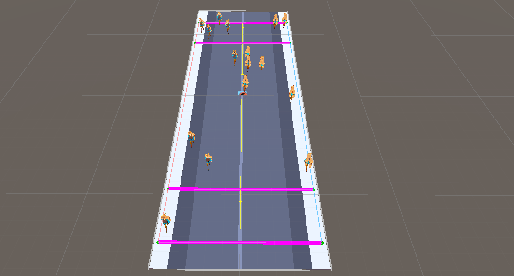

# PopulationFlowMaker

Unityで（右側通行・左側通行等の）歩行者流を生成する簡易ツール。<br>
強化学習等で歩行者流を用意したい場合に利用できます。





## 開発環境

- Unity 2023.2.8f1


## コンポーネント(Assets/Scripts直下)

- `PopulationFlowManager.cs`
  - ライン列・人数・通行方向・停止/逆走の割合など、歩行者流の生成/再生成を管理
- `PedestrianController.cs`
  - NavMeshAgentを用いた歩行者の移動・速度の制御
- `LineObject.cs`
  - Start/Intermediate/Goalの各ラインを表し、生成範囲と経路区切りを定義


## クイックスタート

1. **ラインを配置**
   - ここで言う「ライン」とは以下をアタッチしたCubeオブジェクトです
     - `LineObject.cs`、`Box Collider(Is Trigger)`
   - スタート/ゴールを各1つ、中間ラインを2つ以上
   - 並び順は「スタートライン → 中間ライン（複数） → ゴールライン」
   - ※ 中間ラインが2つ未満だと歩行者は生成されません
2. **歩行者プレハブを準備**
   - `PedestrianController.cs`、`NavMeshAgent`、`Rigidbody`、`Collider` をアタッチ
   - `PedestrianController.cs`の以下のパラメータを設定
     - `minSpeed`：最小速度
     - `maxSpeed`：最大速度
     - ※ 速度は上記で指定された範囲でランダムに設定されます
3. **歩行者流マネージャを設定**
   - Empty Objectに `PopulationFlowManager.cs` をアタッチ
   - Inspectorで設定するパラメータ
     - `IsLeftSideTraffic`：左側通行かどうか（false：右側通行）
     - `frontierStart`, `frontierGoal`：両端のライン(スタート・ゴールライン)
     - `intermediateLines`：中間ラインのリスト（2つ以上）
       - ※ スタートライン側 -> ゴールライン側 の順でリストに登録してください
     - `pedestrianPrefab`：歩行者の Prefab
     - `S2GPedestrianCount` / `G2SPedestrianCount`：各方向の生成人数
     - `ratioStationary`：停止者の生成確率（%）
     - `ratioReversing`：逆走者の生成確率（%）
4. **NavMeshをベイク**
5. **再生すると歩行者流が生成される**
6. **再生成したい場合は`PopulationFlowManager.Regenerate()`を実行**
   - エディター上では、インスペクターのコンテキストメニューから実行可能。


## 仕様・注意

- 生成位置：両端（Start/Goal を含む）セグメントには歩行者は生成されません。（そのため中間ラインは2つ以上が必須です）
- 想定：平坦な地形


## ML-Agents との連携

エージェントスクリプトで毎エピソード開始時にパラメータをランダム化し、再生成すると強化学習に利用可能。

歩行者流の再生成:
```csharp
public PopulationFlowManager manager;
public override void OnEpisodeBegin()
{
  manager.Regenerate();
}
...
```

パラメータのランダム化例:
```csharp
manager.S2GPedestrianCount = Random.Range(5, 15);
manager.G2SPedestrianCount = Random.Range(5, 15);
manager.IsLeftSideTraffic = Random.value > 0.5f;
manager.Regenerate();
```
